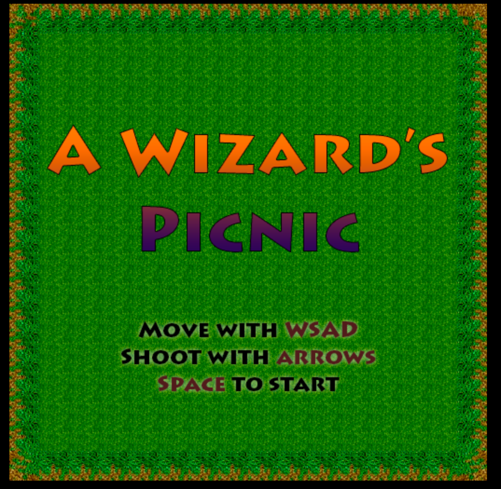

# Chapter 10 ReactJS Blueprints

Create a game in canvas with React

## Version 1.0

The code from the book is available in tag v1.0

## Version 2.0

The current code in the master branch is updated 
to using webpack 2

The current code also uses yarn rather than _npm
shrinkwrap_

# Demo

http://reactjsblueprints-chapter10.herokuapp.com

# Install

- git clone
- npm install (or preferably *yarn*)
- npm start (or *yarn start*)

Open web browser and go to http://localhost:8080

